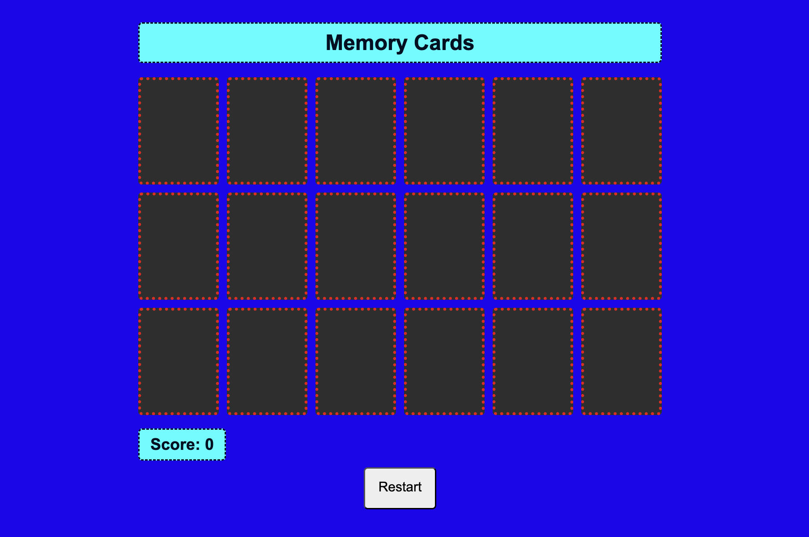

# Game-Project
# Memory Card Game 🃏

A simple beginner-friendly memory card matching game built with HTML, CSS, and JavaScript. Flip the cards, find the matching pairs, and try to get the highest score!

## Screenshot
  

## Getting Started
Check out the deployed game here: [Memory Game Live](https://github.com/VukaleV/Game-Project)

**Instructions:**
1. Press the **Start** button to begin the game.
2. Click on cards to flip them and find matching pairs.
3. Each correct pair adds 10 points to your score.
4. Press **Reset** to restart the game at any time.

## Technologies Used
- HTML
- CSS
- JavaScript

## Next Steps / Stretch Goals
- Add sound effects when a pair is matched
- Add a timer or leaderboard
- Make the game mobile-responsive
- Add different difficulty levels (more cards)
